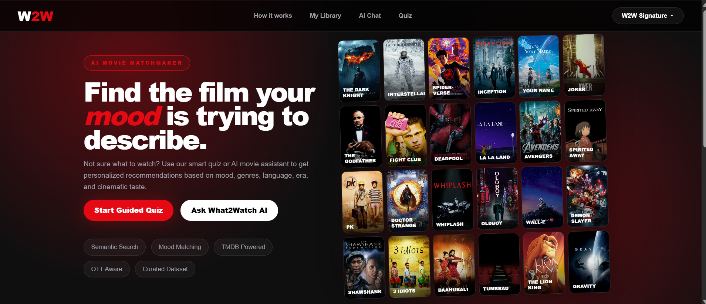
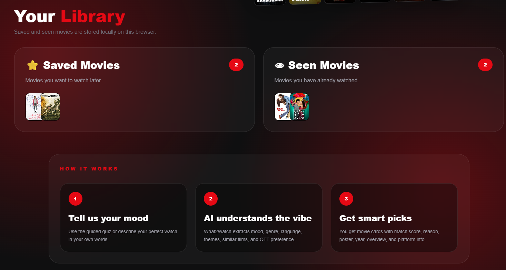

# 🎬 What2Watch

**What2Watch** is an AI-powered movie recommendation platform that transforms movie discovery into a personalized experience.

Through a guided 7-step quiz, cinematic personality profiling, AI-powered recommendations, and reference-based matching, users can quickly discover movies that align with their mood, taste, language preferences, and viewing habits.

🌐 **Live Demo:** https://what2watch-beryl.vercel.app
📂 **GitHub Repository:** https://github.com/AARUSHI29-G/what2watch
<p align="center">
  
</p>

---

## ✨ Features

### 🎯 7-Step Guided Movie Discovery Quiz
Users answer a structured 7-step quiz covering mood, genre, language, OTT platform, era, vibe, and viewing preferences to receive highly personalized recommendations.

### 🤖 AI Movie Matchmaker
Uses Gemini AI and semantic preference matching to understand user intent and generate tailored movie suggestions.

### 🎭 Cinematic Personality System
Analyzes quiz responses and assigns users a unique movie personality such as *The Emotional Dreamer*, *The Cinematic Explorer*, or *The Thrill Seeker*.

### 🎬 Reference-Based Recommendations
Users can provide a movie they already love, and the platform recommends similar films with matching themes, tone, and storytelling style.

### 🌍 Multi-Language Movie Discovery
Supports recommendations across Hindi, English, Korean, Japanese, Tamil, Telugu, Malayalam, and international cinema.

### 📺 OTT-Aware Recommendations
Filters recommendations based on preferred streaming platforms to help users find movies they can actually watch.

### 📝 AI Movie Summaries
Generates concise AI-powered summaries explaining the plot, themes, and appeal of recommended movies.

### ⭐ Personal Movie Library
Users can save movies they want to watch later and build their own watchlist directly within the platform.

### 👀 Seen Movie Tracking
Allows users to mark movies as watched to avoid repetitive recommendations.

### 🎨 Multi-Theme Experience
Switch seamlessly between W2W Signature, Spotify Mode, IMDb Mode, and Midnight Mode to personalize the movie discovery experience.

### 🚀 Fully Deployed
Hosted on Vercel with automatic CI/CD deployment through GitHub integration.

---

## 🖼 Preview

### 📚 Library


---

### 🎯 Guided Quiz


---

### 🎬 Quiz Results


---
### 🎥 Movie Summary


---

### 🎭 Movie Personality Popup


---

### 🤖 AI Recommendation


---

## 🛠 Tech Stack

| Technology       | Purpose                         |
| ---------------- | ------------------------------- |
| **Next.js**      | Frontend framework and routing  |
| **TypeScript**   | Type-safe development           |
| **Tailwind CSS** | Styling and responsive UI       |
| **Gemini AI**    | AI-powered recommendation logic |
| **TMDB API**     | Movie metadata and posters      |
| **LocalStorage** | Saved and seen movie tracking   |
| **Vercel**       | Deployment and hosting          |

---

## 📁 Project Structure

```bash
what2watch/
├── app/
│   ├── api/
│   ├── quiz/
│   ├── results/
│   ├── globals.css
│   ├── layout.tsx
│   └── page.tsx
├── data/
├── lib/
│   ├── aiIntentParser.ts
│   ├── data.ts
│   ├── geminiIntent.ts
│   ├── genreProfiles.ts
│   ├── movies.ts
│   ├── recommender.ts
│   ├── semanticMatcher.ts
│   └── themes.ts
├── public/
├── package.json
├── tsconfig.json
└── README.md
```

---

## 🚀 Getting Started

### 1. Clone the repository

```bash
git clone https://github.com/AARUSHI29-G/what2watch.git
```

### 2. Move into the project folder

```bash
cd what2watch
```

### 3. Install dependencies

```bash
npm install
```

### 4. Create environment file

Create a `.env.local` file in the root folder:

```env
GEMINI_API_KEY=your_gemini_api_key
TMDB_API_KEY=your_tmdb_api_key
```

### 5. Run the development server

```bash
npm run dev
```

Open:

```bash
http://localhost:3000
```

---

## 🌐 Deployment

The project is deployed using **Vercel**.

Every push to the `main` branch automatically triggers a new production deployment.

Live URL:

```bash
https://what2watch-beryl.vercel.app
```

---

## 🎯 Future Improvements

* User authentication
* Personalized watch history
* Advanced AI chat assistant
* More refined movie personality engine
* Recommendation explanation scoring
* Mobile app version

---

## 👩‍💻 Author

**Aarushi Gullia**

* GitHub: https://github.com/AARUSHI29-G
* Project: What2Watch
* Live Demo: https://what2watch-beryl.vercel.app

---

## ⭐ Support

If you like this project, consider starring the repository.
